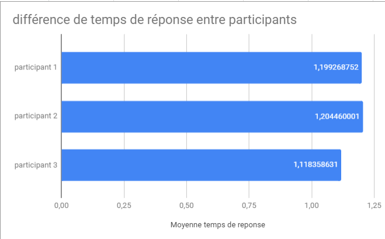
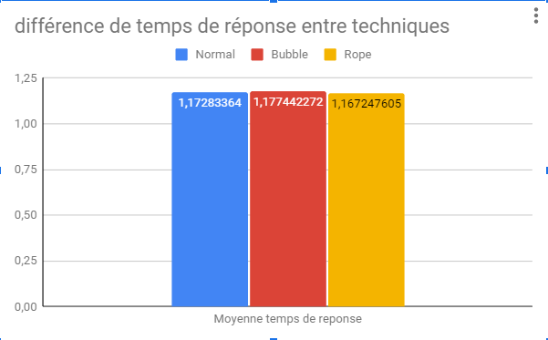
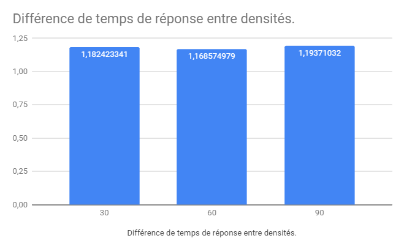
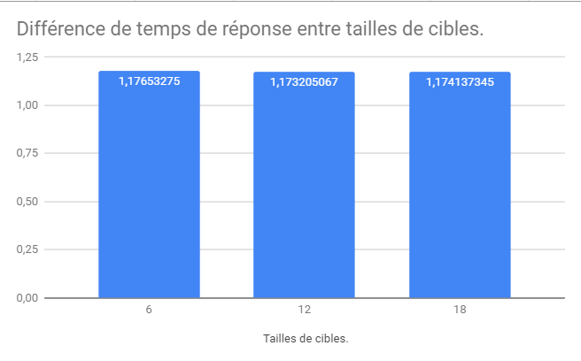
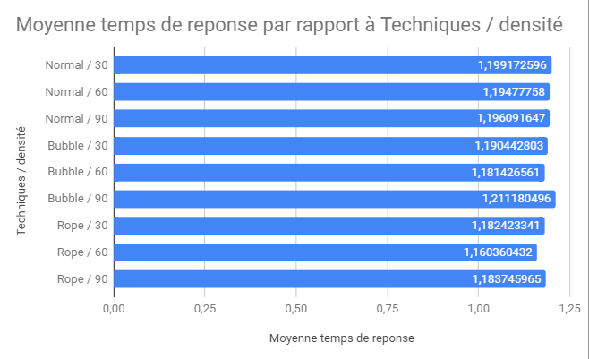
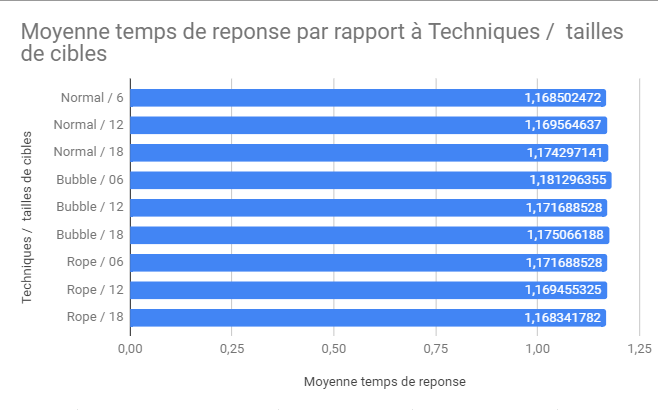

# TP8/TP10 - Programmation d'une expérience contrôlée / TP Expérience contrôlée et analyse des résultats

liens:<br>
[TP8](https://thomaspietrzak.com/teaching/IHM/TP-expe.html) <br>
[TP10](https://thomaspietrzak.com/teaching/IHM/tp-analyse.html) <br>

Pour executer le generateur de csv il suffit de faire appel a : targetsGenerator.py avec 2 arguments obligatoire. Le premier c'est la densité (le nombre de cible) et le second la taille des cibles.

exemple :
```python
python3 ./targetsGenerator.py 90 12
```

Ce generateur se base sur l'algorithme [fast poisson disk](https://www.cct.lsu.edu/~fharhad/ganbatte/siggraph2007/CD2/content/sketches/0250.pdf).

Pour tester les expériences il suffit de lancer : 
```python
python3 ./MainBubble.py
```
## Analyses des résultats des expériences :

Vous pouvez retrouver le csv brut dans `./result.csv`<br>
L'analyse est disponible sous le format pdf ou xlsx dans le repertoire `./experiences/`

## Différence de temps de réponse entre participants.



Nous pouvons observer que le participant 3 a été le plus rapide.

## Différence de temps de réponse entre techniques.


La technique la plus efficace semble etre avec le curseur Rope avec 1.167 s de moyenne.

## Différence de temps de réponse entre densités.


On observe en fonction de la densité un temps de réponse moyen plus élévé pour 90 et 30 cibles. 

## Différence de temps de réponse entre tailles de cibles.



On peut observer pratiquement le meme temps de réponse entre les differentes tailles de cibles. Cela montre que la taille de la cibles n'est pas directement liée a un réponse plus lente.

## Différence de temps de réponse entre techniques et densités.


la technique Rope a l'air d'etre la plus efficace en comparant la techniques et la densité.

## Différence de temps de réponse entre techniques et tailles de cibles.


On voit encore une fois que la taille de la cible ne joue pas sur le temps de réponse du participant, puisque on a pratiquement les meme temps de réponse. 

## Conclusion :

La technique avec le Rope curseur semble la plus efficace, cependant on voit qu'il le nombre de cibles (densité) peut beaucoup impacter le temps de réponse.
On voit aussi que la techniques normal de selection est la plus lente.
